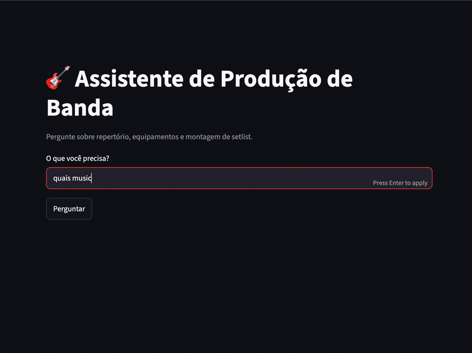
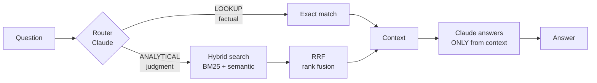

# 🎸 Band Assistant

> **Track 01** · A RAG that builds setlists, looks up gear and solves stage problems. Built by someone who actually gets on stage.

Every gig raises the same questions: *what do we play for this crowd? What gear do I have? This speaker has no XLR out, how do I adapt?* The answers existed, but only in my head. This project turns that stage know-how into an assistant that answers in natural language **and doesn't make up what it doesn't know**.

<!-- TODO: ~15s demo GIF -->


🔗 **[Try it live](https://band-assistant.streamlit.app/)**

> The knowledge base and the assistant speak Brazilian Portuguese: that's the language of my repertoire and my gigs.

---

## What it does

| You ask | What happens |
|---|---|
| *"monta um set pra público sertanejo"* (build a set for a sertanejo crowd) | Retrieves songs by mood, energy and audience, builds the set **and explains what it left out and why** |
| *"tem música da Pitty?"* (do we have any Pitty songs?) | Exact lookup: returns what exists, or says it's not there. No "maybe" |
| *"qual amplificador eu tenho?"* (which amp do I have?) | Direct lookup in the gear inventory |

---

## How it works



1. **Router:** an LLM classifies the question *before* any retrieval happens
2. **Lookup** → literal match on normalized text. It either matches or it doesn't.
3. **Analytical** → hybrid search: keyword (BM25) + semantic similarity (ChromaDB), merged with Reciprocal Rank Fusion
4. **Answer:** Claude generates the response, instructed to use *only* the retrieved context and to say so when the data isn't there

---

## 📝 Liner notes: the decisions behind it

The part that matters most. Every decision below came from something that broke.

### 1. The Pitty case: when the bug isn't where it looks
I asked *"do we have any Pitty songs?"* and the assistant said no. But there was one. I debugged it layer by layer:

- **Semantic search?** Weak for point facts: short chunks lost to the rich, detailed song chunks.
- **Added hybrid search** (BM25 + semantic). Better, still not fixed.
- **The root cause was chunking:** ingestion split on `## ` headers, and Pitty was a bullet inside a ~40-song block. One giant chunk points at nothing.
- **Fixed chunking** with a strategy per file type: lists split by line, rich documents split by section. 45 chunks became 127.

### 2. Two kinds of question, two tools
Fixing the chunking created a new problem: short chunks became noise (Pitty showing up in a search for "sertanejo"). That's when it clicked: **I was using similarity to answer a question that demands exactness.**

- *"Do we have Pitty?"* isn't a similarity question. It's yes or no.
- *"What works for a sertanejo crowd?"* is judgment. That's where similarity belongs.

Solution: **query routing**. An LLM classifies the question and sends it down the right path. I chose LLM classification over fixed rules because rules break on phrasing nobody anticipated.

### 3. Why RRF instead of adding scores
BM25 scores run from 0 to 3+, semantic similarity from 0 to 1. Adding raw scores lets one drown the other. RRF adds up **rank positions** instead, which puts both searches on the same scale.

### 4. Why no stopword list
A stopword list is fragile: someone decides what's irrelevant, and that someone gets it wrong. I normalize punctuation and skip very short tokens instead.

### 5. The LLM retrieves, the musician decides
LLMs are great at **retrieving** musical knowledge and bad at **reasoning** about music theory (ordering songs by key, inventing medleys that actually fit): they get it wrong with confidence. So the musical judgment is written into the knowledge base, by me. The RAG retrieves and organizes it.

### 6. Specs and problems in the same block
Gear specs and known workarounds live together, grouped **by moment of use** rather than by data type. Asking about the drum setup brings the adaptation warning along with it.

### 7. Content-agnostic by design
The public repo ships without chord charts or lyrics; the version I use at gigs has them, and they can't be public. Bonus: that forces the code to be agnostic to the content. Swap the `knowledge_base/` folder and you've swapped the band.

### 8. Same bug, twice: tokenize both sides the same way
After wiring hybrid search into the analytical path, "build a set for a sertanejo crowd" stopped finding the one song tagged for that audience. The keyword side was blind: splitting on spaces turned `sertanejo/"valley"/camarote` into a single token, and a question typed without accents ("publico") never matched "público". With nothing meaningful to match, BM25 ranked chunks by the word "pra". It was the same class of bug I'd already fixed in exact lookup (a "?" glued to "pitty?"). Fix: one tokenizer (lowercase, strip accents and punctuation) applied to both the corpus and the question.
---

## 🔇 Known limitations

Honest list, because these are the next things to fix:

- **Embeddings:** ChromaDB's default embedding model is English-centric, and the base is in Portuguese. Semantic search works, but a multilingual model should do better.
- **Exact lookup is token-based:** it matches any meaningful word from the question, so a generic word can pull in more than intended.
- **No evaluation set yet:** quality is checked by hand-picked test questions, not a measured benchmark.

---

## 🎛️ Credits (tech stack)

| | |
|---|---|
| **LLM** | Claude (Anthropic API) |
| **Vector store** | ChromaDB |
| **Keyword search** | rank-bm25 |
| **Interface** | Streamlit |
| **Language** | Python |

**Knowledge base:** 22 gear blocks · 21 core songs with mood, energy and audience · 84-song full repertoire → 127 chunks

### Structure

```
knowledge_base/       # gear and repertoire in markdown
ingest.py             # per-file-type chunking
indexar.py            # runs once: embeds chunks and fills the database
buscar.py             # semantic search
buscar_hibrido.py     # BM25 + semantic + RRF
roteador.py           # classifies and routes the question
responder.py          # builds context and calls Claude
app.py                # Streamlit interface
jornada.md            # build journal (in Portuguese)
```

> Indexing and searching are separate on purpose: indexing only runs when the data changes; searching runs on every question.

### Run it locally

```bash
git clone https://github.com/dannychris2212/band-assistant.git
cd band-assistant
python -m venv venv
source venv/bin/activate
pip install -r requirements.txt

# create a .env file with:
# ANTHROPIC_API_KEY=your-key

python indexar.py
streamlit run app.py
```

---

## 🎤 About

I'm a musician (guitar, drums, vocals) and a self-taught product builder. This project started as a real stage problem and became my training ground for RAG engineering and version control, from the very first commit. The build journal lives in [`jornada.md`](jornada.md).

**Upcoming tracks:** chord progressions the way I play them · medley building · show ordering by key · multilingual embeddings

## License

MIT
